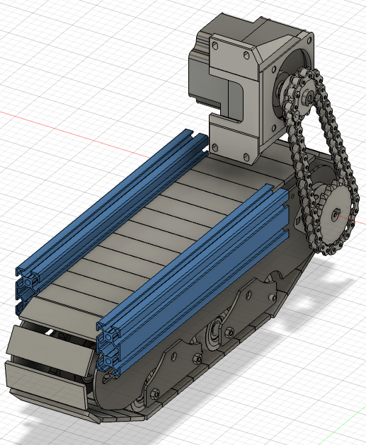

# クローラの作り方

[ソフトウェアはこちらから](software)

普通の人は，[カワシマ](https://recyclecube.jp/itemindex/item13/2394/)とかの幅可変クローラとか，[fieldrobotics](https://www.fieldrobotics.it/)のクローラとか，適当に買っておけば良いと思う．
特に前者は，ヤフオクで送料を除けば10万円以内で買えて非常にお得だし，エンジン式なのでパワフルだ．私も土地があればこれを買いたいと強く思っている．
あるいは，小型で電動の[CuGo V4](https://cuborex.base.shop/items/78596911)なんかも良いと思われる．
自分で一から組み立てると時間と労力が喰うので，メンテしやすいものを買うのが一番だ．

しかし，もし一から作る根気があるという人がいるかもしれないから，共有することにする．
私は特殊な工具を使える環境になかった．もし旋盤やフライス，鋳造具等があれば安く済むだろう．

# 材料リスト

モータが２つで16万円と非常に高い．その他諸々の部材で両輪を作って，フレーム等でロボットの形にすると，大体30-40万円程度で作れる気がする．
当然，計算機やセンサの費用は別だ．
部品点数は非常に多いが，分割してみると意外と単純である．いくつかのブロックに分けて書こうと思う．
なお，これは２輪クローラの場合で個数と金額を出している．

以下，ネジ・ナット・ワッシャは省略しています．一つ一つ買うと数万円いきます．  
M10, M6, M4のネジ，ナット，ワッシャ，スプリングワッシャ等は沢山使うのでまとめ買いしておきましょう．

## モータ周り

最初，近藤科学のKRS-9004で使っていましたが，若干トルク不足でした．もう少し軽量化すればいけそうでした．今はアームに回しています．
この形に行き着くまでに紆余曲折ありました．タイミングベルト形式だと，大型のプーリが高価な上に伝達容量が足りません．
チェーンは安くて気が楽ですね．
一番お金がかかるパートです．オリエンタルのブラシレスを使っています．選定理由は技術職員にお勧めされたからです．
ギア比を考えて，最高速度が1m/sになるようしています．
オリエンタルのオプションのケーブルとかモータマウントは全て買ってください．
また，モータ取り付け板は私は板を買ってボール盤で穴を開けました．CNCフライスがあれば設計して精度良くやってください．
書いてませんがチェーンプライヤ等の工具も買ってください．

| 番号 | パーツ名          | 型番                                     | 個数 | stepデータ | 備考       | 値段        |
|------|-------------------|------------------------------------------|------|------------|------------|-------------|
| 1    | モータ            | [BLMR5100K-20-B](https://www.orientalmotor-shop.jp/products/BLMR5100K-20-B/) | 2個  | -          | 納期２週間 | 74,976 円   |
| 2    | モータドライバ    | [BLVD-KRD](https://www.orientalmotor-shop.jp/products/BLVD-KRD/)             | 2個  | -          | 納期1.5ヶ月 | 70,686 円  |
| 3    | モータマウント    | SOL5M8F                                   | 2個    | -          | -          | 6,000円     |
| 4    | ケーブル          | -                                         | -    | -          | -          | -           |
| 5    | モータ取り付け板  | -                                         | -    | -          | -          | -           |
| 6    | スプロケット小    | [SP40B12-N-18](https://jp.misumi-ec.com/vona2/detail/110300431570/?HissuCode=SP40B12-N-18)   | 2個    | -          | 上側       | 1,000 円    |
| 7    | スプロケット大    | [SP40B18-N-15](https://jp.misumi-ec.com/vona2/detail/110300431570/?HissuCode=SP40B18-N-15)    | 2個   | -          | 下側       | 1,340 円    |
| 8    | チェーン          | [CHE40-42](https://jp.misumi-ec.com/vona2/detail/110302568510/?HissuCode=CHE40-42)  | 42リンク * 2  | -          | -          | 1,988 円    |
| 9    | ジョイントリンク  | [JNTC40](https://jp.misumi-ec.com/vona2/detail/110302568670/?HissuCode=JNTC40)   | 2個     | -          | -          | 300 円      |

## イコライザ

ここは，最初はケチってアルミ板と卓上ボール盤だけで丸一日かけて作ってましたが，meviyで外注するが吉です．
右の写真のように，繋げておくと安くなります．meviy板金で，材質はSUSです．

ちなみに，回転軸に転輪をつける際固定しないと，軸方向に滑って履帯の外にずれたり斜めになったりして走行不能となる原因となります．私の場合，遠方在住の旋盤が使える知人に溝を掘ってもらい，E型リングで固定しました．  
実は，misumiではオプションで溝をつけられる個数の上限が２つまでとなっています．今回は２つの転輪をつけるので，その左右の４つ溝が必要ですね．  
代替案として，スペーサなどの部材でやってみてはどうでしょう？テープとかで無理やり軸ずれを防ぐのはNGです．最初この方法でやっていたのですが，想像以上に力が加わっているらしくダメでした．専用の部材が必要です．

  
  

| 番号 | パーツ名                          | 型番                                                                                                                          | 個数 | stepデータ | 備考 | 値段       |
|------|-----------------------------------|-------------------------------------------------------------------------------------------------------------------------------|------|-------------|------|------------|
| 1   | 板    | -   | -    | [Downloads](step/eqalizers.step)   | 写真右．8個で8000円 | 8000 円    |
| 2   | 回転軸  | [NSFRM12-109-F9-B6-P6-T9-S6-Q6-TL29.5-TR29.5](https://jp.misumi-ec.com/vona2/detail/110300087260/?HissuCode=NSFRM12-109-F9-B6-P6-T9-S6-Q6-TL29.5-TR29.5) | 4    | -           | -    | 4,928 円   |
| 3   | M10ナット・ワッシャ               | -        | 8個     | -   | -   | -          |
| 4   | M6ナット・ワッシャ                | -        | 16個    | -    | -    | -          |
| 5   | 転輪 (ベストローラー BRタイプ) | [ベストローラー BRタイプ ](https://www.monotaro.com/p/7608/4477/)   | 16個     | -    | -    | 12,304 円   |

## 履帯内部のスプロケット，アイドラ周り

モータ周りの項でスプロケット大というのがありました．ここでは，そこに伝わった動力を履帯のチェーンに伝達するところを記述します．

  
  

| 番号 | パーツ名      | 型番 | 個数 | .stepデータ | 備考 | 値段    |
|------|----------|-------|------|-------------|------|---------|
| 1    | スプロケット軸 | [NSFRN15-141.5-F26-B10-P10-WKC39.3-C28-K0-E23](https://jp.misumi-ec.com/vona2/detail/110300087440/?HissuCode=NSFRN15-141.5-F26-B10-P10-WKC39.3-C28-K0-E23) | 2個  | -   | -    | 4,020円 |
| 2    | スプロケット   | [RS50-1B18TQ-H015N-J05D2M05](https://jp.misumi-ec.com/vona2/detail/221303555668/?HissuCode=RS50-1B18TQ-H015N-J05D2M05)    | 2個  | -           | -    | 4,360円 |
| 3    | ベアリング１   | [UFL000](https://jp.misumi-ec.com/vona2/detail/221000346468/?HissuCode=UFL000)  | 2個  | -           | -    | 2,536円 |
| 4    | ベアリング２   | [ASPFL202](https://jp.misumi-ec.com/vona2/detail/221000058828/?HissuCode=ASPFL202)    | 2個  | -           | -    | 2,082円 |
| 5    | ナット，ワッシャ | -     | -    | -           | -    | -       |
| 6    | アイドラ軸     | [NSFRHM25-103-F13-B10-P10-T13-S10-Q10-TL47.2-TR27.8](https://jp.misumi-ec.com/vona2/detail/110300087260/?HissuCode=NSFRHM25-103-F13-B10-P10-T13-S10-Q10-TL47.2-TR27.8) | 2個  | -           | -    | 4,060円 |
| 7    | アイドラ       | [DRCBW50-18](https://jp.misumi-ec.com/vona2/detail/110302282910/?HissuCode=DRCBW50-18)  | 2個  | -           | -    | 7,788円 |
| 8    | M10ナット，ワッシャ | -    | 4個  | -           | -    | -       |

　　
## 外壁，緑のローラー

クローラの外壁をmeviy板金で注文しましょう．材質はSUSです．  
また，チェーンの撓み防止のために，緑色のローラーをつけます．わかりづらいですが，写真２の上にずらりと穴が並んでいますね．この穴のうち，２つがローラー用のM6で，他がTナット用のM4となっています．
左右の外壁で穴がそれぞれ２つあるので，最大４つ付けれます．個数は現物合わせで調整してください．

ちなみに，セリカタイヤを切断した時，短冊長を10cmにしたいなと思っていました．そしたら，タイヤの溝幅がちょうど10cmでした！外壁間距離を103mmとして設計してあります．
ゆえに，ローラーがないとタイヤが外壁に挟まれるように陥没し，摩擦が増大して走行不能になります．  

  
  

| 番号 | パーツ名 | 型番/商品名 | 個数 | stepデータ | 備考 | 値段 |
|------|----------|-------------|------|-------------|------|-------|
| 1    | 外壁１   | -           | 2個  | [Download](step/frame1.step) | - | 11,100円 |
| 2    | 外壁２   | -           | 2個  | [Download](step/frame2.step) | - | 11,100円 |
| 3    | ローラー | [C-TMBH10-40](https://jp.misumi-ec.com/vona2/detail/110310392759/?HissuCode=C-TMBH10-40) | 8個  | - | - | 6,248円 |

　　
## 履帯

ここが一番苦労しました．古タイヤ，カッター，サンダーを用意します．(写真１)  
まず，タイヤから，ホイールを外します．(写真２)  
次に，輪を切って長い短冊状にして，RS50のチェーンのピッチ長より気持ち短めの幅でカットします．予備含めて100個くらいの短冊を作りましょう．丸２日かかりました．ゴム臭で近所迷惑にならぬようしましょう．ピッチ長ちょうどでやると，隣同士が重なり合って取り付けができません．私の場合，ピッチ長ちょうどのものと，短いものの２種類を作って，交互に取り付けました．
こうして得た短冊状のタイヤを，チェーンに装着していきます．（写真４）  
そのためにまず，タイヤに２つ穴を開けておきましょう．（写真３．私は穴を先に開けました．最初に短冊にした方が絶対効率が良いです．）  
そしてドリルネジで串刺しにしましょう．

  
  
  
  

### ここで，チェーンとタイヤが取れないための２つのポイントを紹介します．  

1. ロックタイトをネジ穴に塗りたくる
2. ビスの長さは，19mm. ただし，トヨタのセリカのタイヤの場合です．

ポイントは，ネジ長がタイヤを数mm突き破るくらいがちょうど良いということです．
突き破ることで抜けにくくなることと，突き破っても土の上で走らせるとドリルネジの先端に土の塊が付着するため，危なくない，ということが大事です．
私はこれに辿り着く前は，実験の度にタイヤが取れて，都度分解して装着し直していました．そしてタイヤを沢山紛失しました．

ちなみに，電動ドライバは[こちら](https://www.amazon.co.jp/%E3%83%99%E3%83%83%E3%82%BB%E3%83%AB-VESSEL-%E3%83%9C%E3%83%BC%E3%83%AB%E3%82%B0%E3%83%AA%E3%83%83%E3%83%97-%E3%83%93%E3%83%83%E3%83%881%E6%9C%AC%E4%BB%98-220USB-1/dp/B07KSBSK4Z/ref=sr_1_5?__mk_ja_JP=%E3%82%AB%E3%82%BF%E3%82%AB%E3%83%8A&crid=13OMJLVJ2LDVM&keywords=%E9%9B%BB%E5%8B%95%E3%83%89%E3%83%A9%E3%82%A4%E3%83%90&qid=1706804757&sprefix=%E9%9B%BB%E5%8B%95%E3%83%89%E3%83%A9%E3%82%A4%E3%83%90%2Caps%2C181&sr=8-5&th=1)がお勧めです．これがあると作業能率が上がります．

| 番号 | パーツ名                            | 型番/商品名                                                                                                                                                                                                                   | 個数 | .stepデータ | 備考 | 値段   |
|------|-------------------------------------|--------------------------------------------------------------------------------------------------------------------------------------------------------------------------------------------------------------------------------|------|-------------|------|--------|
| 1    | 古タイヤ| - | -  | -  | 私はトヨタのセリカ | -  |
| 2    | アタッチメント付 RS50形チェーン | [RS50-K1-2LK1+71L-JJ](https://www.monotaro.com/p/4830/0077/)  | 71個 * 2 | -  | - | 6,091円 * 2|
| 3    | アタッチメント付ジョイントリンク | [RS50-1-MCJL](https://www.monotaro.com/p/0723/1287/)  | 2個  | -  | -  | 636円  |
| 4    | ドリルネジ  | [ステンレスドリルねじ](https://www.amazon.co.jp/gp/product/B0C5XLQ65K/ref=ppx_yo_dt_b_asin_title_o09_s00?ie=UTF8&th=1) | 1セット | - | - | 1,880円|
| 5    | ロックタイト | [LOCTITE243](https://www.amazon.co.jp/LOCTITE-%E3%83%AD%E3%83%83%E3%82%AF%E3%82%BF%E3%82%A4%E3%83%88-%E3%81%AD%E3%81%98%E3%82%86%E3%82%8B%E3%81%BF%E6%AD%A2%E3%82%81%E6%8E%A5%E7%9D%80%E5%89%A4-%E3%83%9C%E3%83%88%E3%83%AB%E3%82%BF%E3%82%A4%E3%83%97-1550211/dp/B00KYLWRO2/ref=sr_1_5_pp_mod_primary_new?__mk_ja_JP=%E3%82%AB%E3%82%BF%E3%82%AB%E3%83%8A&crid=37YNZ8V7ISH28&keywords=%E3%83%AD%E3%83%83%E3%82%AF%E3%82%BF%E3%82%A4%E3%83%88&qid=1706804614&sbo=RZvfv%2F%2FHxDF%2BO5021pAnSA%3D%3D&sprefix=%E3%83%AD%E3%83%83%E3%82%AF%E3%82%BF%E3%82%A4%E3%83%88%2Caps%2C232&sr=8-5) | 1個  | -  | -  | 850円  |

## その他

1. 骨格フレームについて  
書いてませんが，tナットネジとか，ミスミフレームとか，SUSのG-funとか，骨格を作るためのフレームを購入しましょう．  
tナットの穴径をよくミスったのと，色々混ざりすぎて何が何だか，，，  
最初から統一しておくことを強くおすすめします．

2. 電源・モータドライバ周りについて   
私は，[Jackery ポータブル電源 400](https://www.amazon.co.jp/Jackery-%E3%83%9D%E3%83%BC%E3%82%BF%E3%83%96%E3%83%AB%E9%9B%BB%E6%BA%90-400-%E5%A4%A7%E5%AE%B9%E9%87%8F110000mAh-%E7%9E%AC%E9%96%93%E6%9C%80%E5%A4%A7400W/dp/B07PJYQVSG?th=1)を採用しています．これより大きい容量だと私のロボの構造では乗りません．クローラ用モータは24Vなので専用バッテリを使えばもっとコンパクトにできるでしょう．しかし，ロボを使わない時キャンプできるとか，非常時に使えるとか，そういう点でアウトドアを好みます．アマゾンのセールでお得に買いましょう．
スイッチングは，モータの定格出力が24V10Aなので，それが二つということで480Wです．余裕を持って24V480Wというスペックにしましたが，突入電流でも100Wいかないくらいでした．オーバースペックだったかなーと思っています．あと購入時より3000円くらい値上がりしていました．ここでは購入時の金額で書いてあります．
あと，モータはCAN通信もできますが今回はRS485通信にしました．
保護ケースとしてタカチを使っていますが，もっと良いで保護したいなーとずっと思っています．

| 番号 | パーツ名   | 型番/商品名   | 個数 | .stepデータ | 備考 | 値段    |
|------|------------------|-----------------|------|-------------|------|---------|
| 1    | バッテリ  | [Jackery ポータブル電源 400](https://www.amazon.co.jp/Jackery-%E3%83%9D%E3%83%BC%E3%82%BF%E3%83%96%E3%83%AB%E9%9B%BB%E6%BA%90-400-%E5%A4%A7%E5%AE%B9%E9%87%8F110000mAh-%E7%9E%AC%E9%96%93%E6%9C%80%E5%A4%A7400W/dp/B07PJYQVSG?th=1) | 1個  | -  | -    | 34,510円 |
| 2    | スイッチング電源 | [ESP20-480-24](https://jp.misumi-ec.com/vona2/detail/110400213820/?HissuCode=ESP20-480-24)  | 1個  | - | - | 14,960円 |
| 3    | ACコード  | [2M-2](https://jp.misumi-ec.com/vona2/detail/110500082830/?HissuCode=2M-2)    | 1個  | -   | -    | 279円    |
| 4    | LANケーブル | [EG5E-A-PV-BE-26-4P-1](https://jp.misumi-ec.com/vona2/detail/110410036179/?HissuCode=EG5E-A-PV-BE-26-4P-1) | 1個 | - | -| 608円 |
| 5    | RS485コンバータ  | [RS485コンバータ](https://www.amazon.co.jp/gp/product/B07B416CPK/ref=ppx_yo_dt_b_asin_title_o09_s00?ie=UTF8&psc=1)                         | 1個  | -  | -    | 2,669円  |
| 6    | 防水ケース１ | [ノックアウト付 IP67防水ボックス SPCMシリーズ](https://www.monotaro.com/p/8822/5645/) | 1個  | - | -    | 2,739円  |
| 7    | 防水ケース２ | [ノックアウト付 IP67防水ボックス SPCMシリーズ](https://www.monotaro.com/p/8822/5566/) | 1個  | -  | -    | 2,079円  |

[この辺のタカチ関連品](https://www.monotaro.com/p/8836/5627/)も適当にポチりましょう．

## 組み立て

ここは北欧式の説明で失礼します．

## 問題点

* スプロケ軸，アイドラ軸，イコライザ軸がありますが，多分，スプロケの軸長が設計ミスで1-2ミリずれてる気がするんです．ベアリングのCADデータからは使い方が分からず，現場合わせしました．
* でもズレが0.3ミリとかな気もして問題ない気もします．ここで書いたものを盲信してもできますが，裏話を言うと私のクローラは左右で設計が違います．ここでは，改良後の方で統一してあります．
* 今だったら，スプロケ軸，ベアリング，およびモータ周りのスプロケの軸穴径を変えます．
* あと，アイドラの穴が大きいのに合わせて，アイドラ軸の軸径が太くなってしまっています．軽量化するためにここを変えたいです．
* あと，モータを防水防塵にしたい．
* 配線がごっちゃごちゃ．未踏やデモのために頻繁に分解して運搬するので，分解のしやすさを優先している．落ち着いたらまとめたい．
