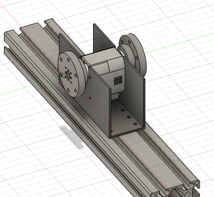
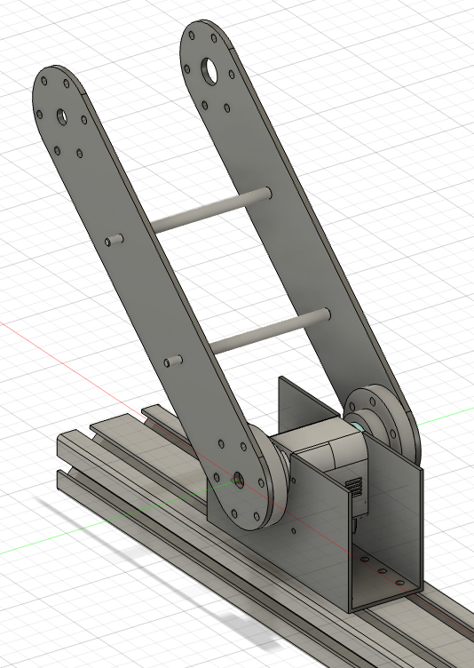
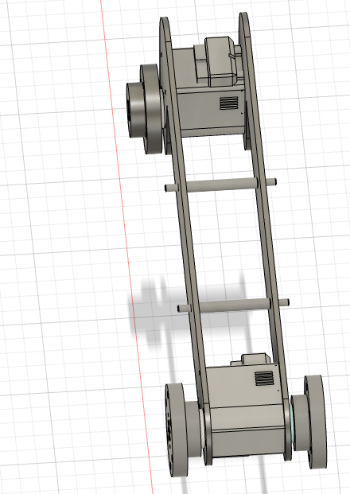
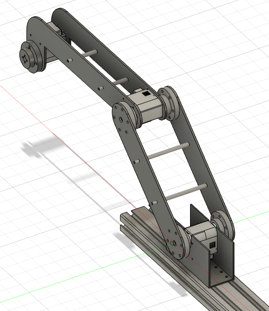
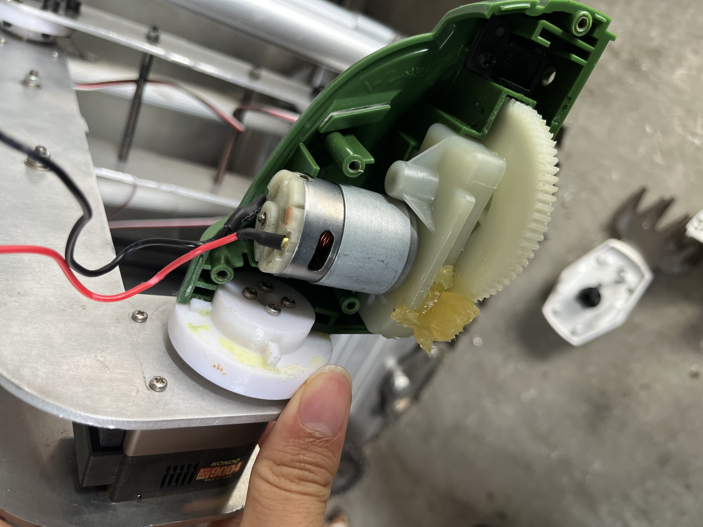
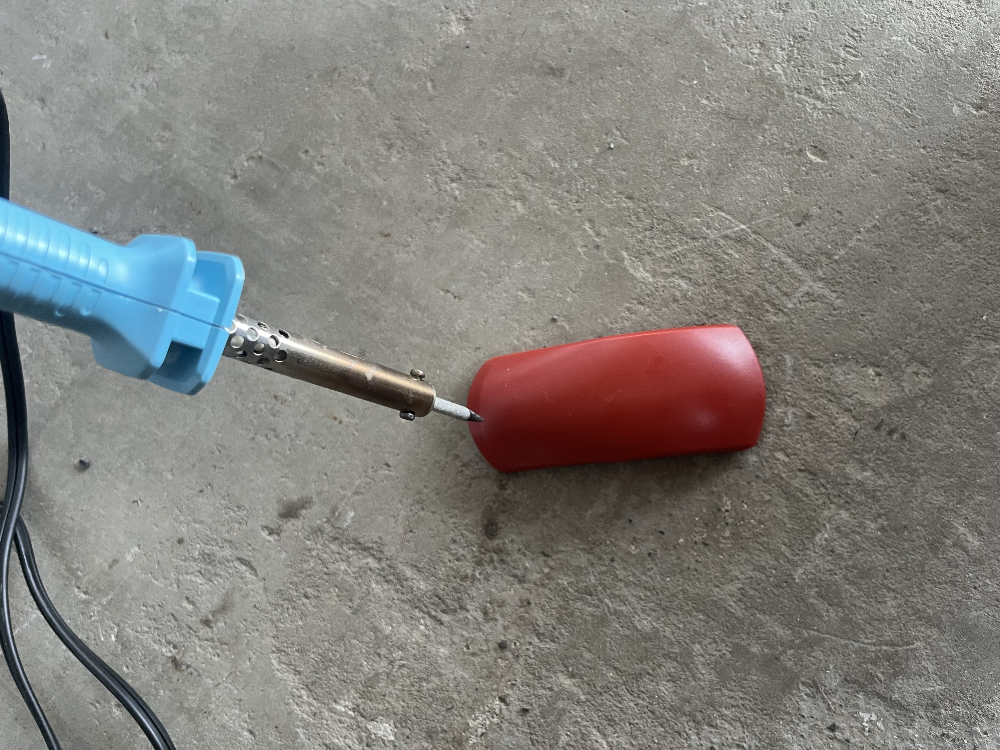
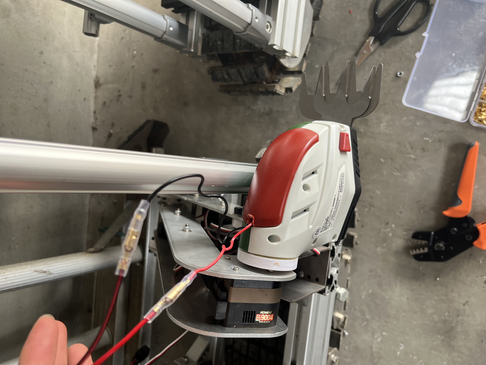
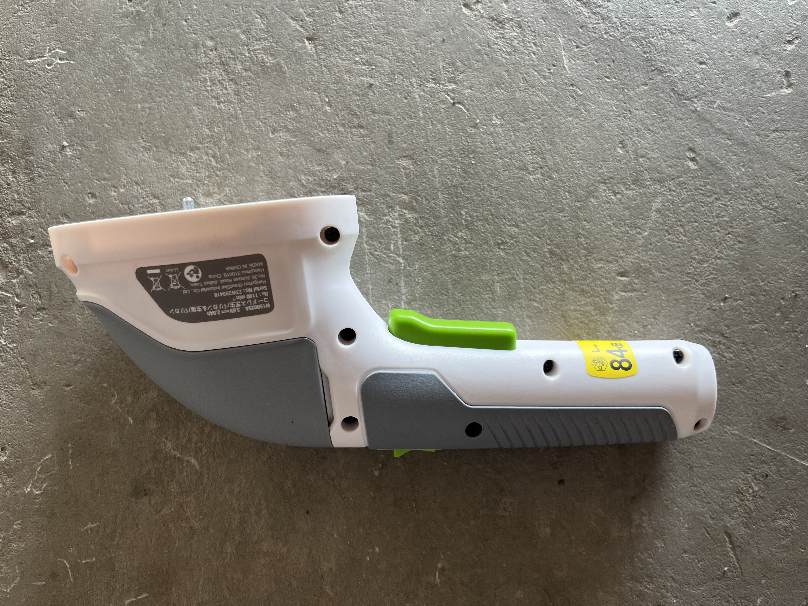
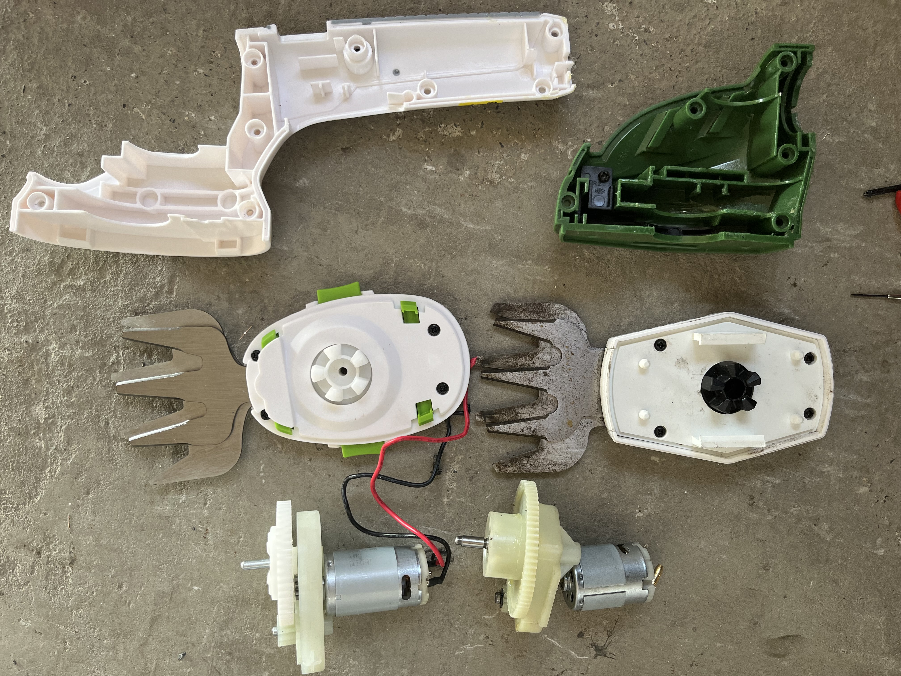
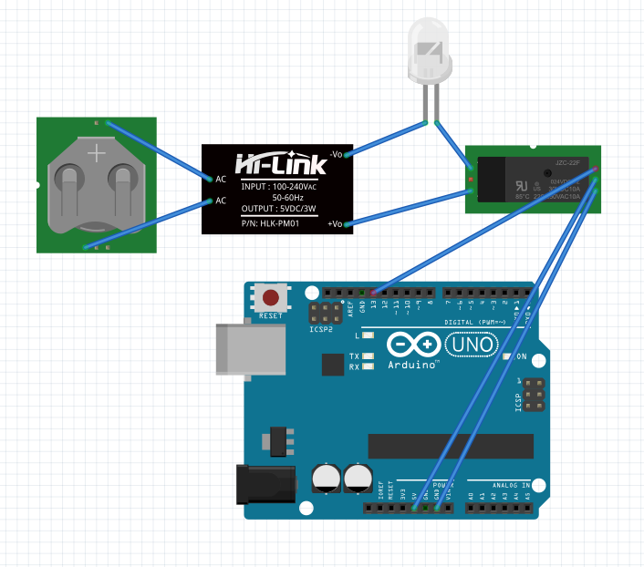

# バリカン除草用マニピュレータの作り方【ハードウェア編】

ここでは，除草マニピュレータのハードウェアの作成方法を示します．
ソフトウェアは，[こちらから](software)

---

---

### バリカン除草を選定した経緯

除草用の道具の歴史は古く，地方によって，また作付け体系によって非常に多種多様な変化を遂げてきました．今回は，畑作の畝作物を想定して，新しい雑草管理法を提案します．
一つの作物に対して，それ以外の植物を全て雑草とみなす従来の農業というものを括弧に括ることから始めます．
そこにおいて，
１．自然農などの方法に通底した，必要以上の撹乱をしない哲学，
２．スマート農業のような人間の労力的な点での持続可能性，
という，イデオロギーの排反した２つの農業の方法の良さを取り込んでみましょう．
すると，作物の生育の上で悪影響のある雑草が繁茂しない・種を残さないという条件を満たす機械を作れば良いという一つのアイデアが出てきます．
自給的農業の性向の強い日本において，小さく扱いやすい機械が望まれること，誰でも修理ができること，という条件を課していきます．
そこで，ホームセンターや通販ですぐ手に入るような除草道具を改造するという結論に至りました．
除草道具は様々ありますが，確実な効果があること，石が飛ばない等の安全性が高いこと，除草の作業能率が実時間で運用する上で十分に高いこと，省電力であることという条件が加わります．
実験・調査の結果，除草用のミニ芝刈りバリカンが最適であるという一つの結論に達しました．
とはいえ，小規模ならばマルチを張る物理的防除，大規模ならば中耕・株間除草機やホーを用いた機械的防除，また，いずれの場合も除草剤を用いた化学的防除法が有効です．
バリカン除草は未踏的試みなため，普通の人はそちらをお勧めします．

### バリカン除草によって可能になること

畝から一定以上の高さだけ刈ることになる．．
地面に這うようなスベリヒユと共生した作付けは如何？  
藁マルチの上に出てきた草を刈ることも可能だが，クローラが藁を巻き込んでしまうか

# 作り方

## 部品リスト  

納期を長くすることで金額を15万円以内に抑えました．  
詳しい人は中華製モータで代用して節約しても良いでしょう．バリカンは重いので90kgf $\cdot cm ^{-1}$ くらいないと持ち上がりません．私はすぐに使えるものが欲しかったので，近藤科学のモータを選定しました．
モータに関連するパーツ，アームのフレームに関連するパーツ，フレーム同士・モータとフレームの連結に使うパーツ，エンドエフェクタのバリカンに関連するパーツから構成されます．  
バリカンは，類似品が多いので注意が必要です．「ミニ」バリカンで，かつハンドル部分が回転するタイプを選定してください．色違いが３種類くらいあるのでどれでも良いです．
次に，主要パーツを示します．

| 番号 | パーツ名                        | 型番                                                                                   | 個数 | STLデータ | .stepデータ | 備考             | 値段                  |
|------|---------------------------------|----------------------------------------------------------------------------------------|------|-----------|-------------|------------------|-----------------------|
| 1    | サーボモータ  | [KRS-9004HV ICS](https://kondo-robot.com/product/03204)  | 3    | - | -    | -  | 92400円    |
| 2    | モータ用ホーン  | [アルミサーボホーン（Iカット型）](https://kondo-robot.com/product/02189)     | 3    | -   | -   | -  | 3300円   |
| 3    | モータ用ベアリング  | [ベアリング付アルミフリーホーン（B3M/KRS-6000シリーズ用）](https://kondo-robot.com/product/02137) | 2    | -  | -   | EE部分は不要なので２個   | 2640円   |
| 4    | 通信用アダプタ    | [Dual USBアダプターHS](https://kondo-robot.com/product/02116)  | 1    | -  | -  | -  | 6600円   |
| 5    | ベース   | -    | 1    | -    | [Download](step/base.step)  | meviyのSUS板金   | 2460円  |
| 6    | アームリンク     | -     | 1    | -   |  [Download](step/armlink.step)   | meviyのアルミ板金で繋ぎ目要切断 | 20760円 |
| 7    | 回転軸(NSFRMHM6-82.5)           | [NSFRMHM6-82.5-F11-B8-P4-T11-S8-Q4](https://jp.misumi-ec.com/vona2/detail/110300087260/?HissuCode=NSFRMHM6-39.5-F10-B7-P4-T10-S7-Q4)   | 2    | - | - | misumiで注文で太い方なのでリンク１用 | 1000円           |
| 8    | 回転軸(NSFRMHM6-39.5)           | [NSFRMHM6-39.5-F10-B7-P4-T10-S7-Q4](https://jp.misumi-ec.com/vona2/detail/110300087260/?HissuCode=NSFRMHM6-39.5-F10-B7-P4-T10-S7-Q4)   | 2    | -    | -   | misumiで注文で細い方なのでリンク２用 | 900円     |
| 9    | モータマウント1  | -   | 2    | -   | [Download](step/horn2.step)   | 3DPで各自プリント | -  |
| 10   | モータマウント2   | -     | 2    | -   | [Download](step/horn3.step)  | 3DPで各自プリント | -   |
| 11   | ネジ，ボルト，ナット等  | -   | -    | -   | -   | 後で調べる  | -  |
| 12   | バリカンコネクタ1    | -    | 1    | -  | [Download](step/horn_ee1.step) | 3DPで各自プリント | -   |
| 13   | バリカンコネクタ2 | -    | 1    | -  | [Download](step/horn_ee2.step) | 3DPで各自プリント | -   |
| 14   | 除草用具 | [ミニ芝刈り用バリカン](https://www.amazon.co.jp/%E6%96%B0%E7%99%BB%E5%A0%B4%E3%80%91WORKPRO-%E3%83%8F%E3%83%B3%E3%83%89%E3%83%AB180%E5%BA%A6%E8%AA%BF%E6%95%B4%E5%8F%AF%E8%83%BD-%E3%83%90%E3%83%AA%E3%82%AB%E3%83%B3%E5%88%88%E5%B9%8580mm-%E3%83%88%E3%83%AA%E3%83%9E%E3%83%BC%E5%88%88%E5%B9%85120mm-%E6%9C%80%E5%A4%A7%E5%88%87%E6%96%AD%E5%BE%847-5mm/dp/B09YCFFKVQ/ref=sr_1_17?keywords=%E8%8A%9D%E5%88%88%E3%82%8A%E6%A9%9F+%E3%83%90%E3%83%AA%E3%82%AB%E3%83%B3&qid=1707224953&sr=8-17) | 1    | -         | -           | -                | 3580円               |
| 15   | リレー回路  | [KKHMF 3個 5V 1チャンネルリレーモジュール 高低レベル トリガー 「国内配送」](https://www.amazon.co.jp/KKHMF-1%E3%83%81%E3%83%A3%E3%83%B3%E3%83%8D%E3%83%AB%E3%83%AA%E3%83%AC%E3%83%BC%E3%83%A2%E3%82%B8%E3%83%A5%E3%83%BC%E3%83%AB-%E9%AB%98%E4%BD%8E%E3%83%AC%E3%83%99%E3%83%AB-%E3%83%88%E3%83%AA%E3%82%AC%E3%83%BC-%E3%80%8C%E5%9B%BD%E5%86%85%E9%85%8D%E9%80%81%E3%80%8D/dp/B088FLWF81/ref=sr_1_5?keywords=%E3%83%AA%E3%83%AC%E3%83%BC%E5%9B%9E%E8%B7%AF&qid=1706627250&sr=8-5)  | 1    | -   | -   | -  | 592円  |
| 16   | Arduino Uno | -   | 1   | -   | -   | -  | -  |
| 17   | ACアダプタ 5V 4A | [ SUCCUL ACアダプター 5V 4A ](https://www.amazon.co.jp/AC%E3%82%A2%E3%83%80%E3%83%97%E3%82%BF%E3%83%BC-%E5%A4%A7%E6%89%8B%E3%83%A1%E3%83%BC%E3%82%AB%E3%83%BCOEM%E7%A4%BE%E8%A3%BD%E5%93%81-%E3%82%BB%E3%83%B3%E3%82%BF%E3%83%BC%E3%83%97%E3%83%A9%E3%82%B9-%E3%82%B9%E3%82%A4%E3%83%83%E3%83%81%E3%83%B3%E3%82%B0%E5%BC%8F-%E5%87%BA%E5%8A%9B%E3%83%97%E3%83%A9%E3%82%B0%E5%A4%96%E5%BE%845-5mm/dp/B015RKFAA2/ref=sr_1_5_pp?keywords=ac%E3%82%A2%E3%83%80%E3%83%97%E3%82%BF%E3%83%BC%2B5v%2B4a&qid=1706627776&sr=8-5&th=1)  | 1  | -   | -   | バリカンは作動時20W | 1688円 |
| 18   | misumiアルミフレーム | [HFSB6-3060-160](https://jp.misumi-ec.com/vona2/detail/110302686970/)  | 1    | -  | -  | 長さは+-2cmくらい適当で良い | 636円 |

## その他必要工具

知っていると便利なものを紹介します．基本なのですが，教えてくれる人がいないと気がつきません．
ギボシ端子は基本的なケーブルの接続に使います．専用の圧着工具を使いましょう．専用工具でないと外れたり断線したりします（経験済み）．
ただ，バリカンのモジュールをロボットから外したいことがあります．
そこで車用コネクタがあると，すぐに外せます．また，運搬や修理，ハードウェアで電源関係のデバグをする際にも便利です．

| 番号 | パーツ名              | 型番/商品名   | 個数    | .stepデータ | 備考                     | 値段    |
|------|-----------------------|-----------------------------------------------------------------------------------------------------------------------------------------------------------------|---------|-------------|--------------------------|---------|
| 1    | ギボシ端子            | [ギボシ端子セット](https://www.amazon.co.jp/%E3%82%AE%E3%83%9C%E3%82%B7%E7%AB%AF%E5%AD%90%E3%82%BB%E3%83%83%E3%83%88-%E3%82%AE%E3%83%9C%E3%82%B7%E3%82%BF%E3%83%BC%E3%83%9F%E3%83%8A%E3%83%AB-%E7%B5%B6%E7%B8%81%E3%82%B9%E3%83%AA%E3%83%BC%E3%83%96-%E3%82%AB%E3%83%90%E3%83%BC%E4%BB%98%E3%81%8D-0-5%E3%80%9C2%E3%82%B9%E3%82%B1%E3%82%A2/dp/B0BJW69DJ1/ref=sr_1_6?__mk_ja_JP=%E3%82%AB%E3%82%BF%E3%82%AB%E3%83%8A&crid=1D9TJ3QKVRKQ0&keywords=%E3%82%AE%E3%83%9C%E3%82%B7%E7%AB%AF%E5%AD%90&qid=1707225122&sprefix=%E3%82%AE%E3%83%9C%E3%82%B7%E7%AB%AF%E5%AD%90%2Caps%2C251&sr=8-6) | 1   | -  | - | 752円   |
| 2    | ギボシ端子圧着工具    | [アイウィス(IWISS) 精密同時圧着ペンチ](https://www.amazon.co.jp/%E3%82%A2%E3%82%A4%E3%82%A6%E3%82%A3%E3%82%B9-IWISS-%E7%B2%BE%E5%AF%86%E5%90%8C%E6%99%82%E5%9C%A7%E7%9D%80%E3%83%9A%E3%83%B3%E3%83%81-%E3%82%AA%E3%83%BC%E3%83%97%E3%83%B3%E3%83%90%E3%83%AC%E3%83%AB%E7%AB%AF%E5%AD%90-0-25%E3%80%9C1-5mm2%E5%B0%8F%E3%83%BB%E4%B8%AD%E5%9E%8B%E7%AB%AF%E5%AD%90%E5%AF%BE%E5%BF%9C/dp/B092SFZHDJ/ref=sr_1_30?crid=SLMLQP06O1Q1&keywords=%E3%82%AE%E3%83%9C%E3%82%B7%E7%AB%AF%E5%AD%90%2B%E5%9C%A7%E7%9D%80%E5%B7%A5%E5%85%B7&qid=1707225195&sprefix=%E3%82%AE%E3%83%9C%E3%82%B7%E7%AB%AF%E5%AD%90%2Caps%2C285&sr=8-30&th=1) | 1     | -   | -  | 2,080円 |
| 3    | 車用ワイヤーコネクター | [車用ワイヤーコネクター](https://www.amazon.co.jp/TOOHUI-2%E3%83%94%E3%83%B3%E9%98%B2%E6%B0%B4%E3%82%B3%E3%83%8D%E3%82%AF%E3%82%BF%E3%83%BC2-%E3%83%94%E3%83%B3%E3%82%A6%E3%82%A7%E3%82%A4-17AWG-%E9%98%B2%E6%B0%B4%E3%82%AB%E3%83%97%E3%83%A9%E3%83%BC/dp/B07L97LT64/ref=pd_sbs_d_sccl_3_1/358-2434503-2480509?pd_rd_w=RzhAu&content-id=amzn1.sym.e146c92a-7981-4c58-8351-e2a023395915&pf_rd_p=e146c92a-7981-4c58-8351-e2a023395915&pf_rd_r=8YQ5BV5PP2EFVDDGQDHK&pd_rd_wg=Nf3Ge&pd_rd_r=5a235fc3-0808-4873-9679-86a77041561a&pd_rd_i=B07L97LT64&psc=1) | 1 | - | - | 890円   |

## アームの組み立て  

写真の左から順にやれば良い．サーボモータの原点に注意しよう．間違えてもすぐ組み直せるので良いが．
1. 準備として，モータと付属のベアリング，ホーンを組み立てておく．
2. さらに，アルミ板金で発注したアームリンクの連結部分を切断する．
3. 長さ16cm程度のアルミフレームを用意して，ベースとねじ止めする．そこにモータを差し込む，そして3Dプリントしたモータマウント1,2をそれぞれ装着する．写真１の完成．
4. 次にリンク２を組み立てる．細い方のアームリンク対に，モータと細い方の回転軸を取り付ける．あとは同様にモータマウントをつければ写真２の完成．
5. リンク１に戻ろう．ここまでこれば，写真を見るだけで組み立て方がわかるだろう．
6. がっちゃんこすれば完成だ．

  
  
  
  

ただし，ネジ類は省略している．

## バリカンの改造とアームとの連結  

左の図から，横に倒すとネジ穴が見えますね．全てのネジを取りましょう．まずは頭部から左右にパカっと分かれます．（２枚目）  
取手の部分は，隠れてネジが仕込んであるので，それも外すと取手の部分も分かれます．  
で，バッテリを外部化するため図のように動線を切ります．  
半分をアームの部分に嵌めます．（４枚目）  
外れにくくするために，アロンアルファを用います．  
この方法は分解性を低下させるので，今後改善したいのですが，接着剤を用いないと連結部がすぐに折れたり割れたりします．

  
  
  
  

  
あとは，赤い蓋にハンダゴテ等で穴を開け，  
他方の半分のバリカン頭部をがっちゃんこして，蓋をしながら導線を通します．  
ギボシ端子や車用コネクタでバッテリからの導線と繋ぎましょう．  

  
  

#### 余談１：バリカンの構造

  
  

左の写真は，バリカンの部分です．モータの回転を偏心円盤カム機構によって往復直線運動に変換し，バリカンの上刃を駆動していることがわかります．  
右の写真からは，モータの回転からギアによって大きな力を得ていることがわかります．故に，5V4Aという大電流が必要なわけですね．また，右側には取手の部分が写っています．この取手の中にバッテリやら色々なスイッチやら安全ピンやらが入っていますが，今回は不要です．まず，20分しか持続しませんし，オンオフも自動で切り替えられません．  
そこで，リレー回路を用いてArduinoから制御します．後述．  
ロボットの制御はROS 2を用いているので，ROS 2とArduinoのシリアル通信をします．
詳細はソフトウェア編で解説します．  

#### 余談2：バリカンの種類

このコラムは，修理の時に役立ちます．
取手が回転できないタイプのミニ芝刈りバリカンですと，取手部分が取れないので本記事の方法ではアームに接続することができません．必ず，回転できるタイプにしましょう．  
また，パーツの互換性もありません．モータもギアも何から何まで違います．

  
  
  

## 配線図  

雑ですみませんが，こんな感じです．
左上の部分はJackery等のアウトドア用バッテリです．部品リストのACコンバータでコンセントにさして使います．  
で，その隣がAC/DCで，その隣がリレー回路です．
AC/DCとリレーに挟まれたのが，LEDですが，実際はバリカンです．   
リレー回路は，電源側をNO (Normally Open，回路が開いているという意味)に接続します．Arduinoで信号を送ると，カチっという音がして回路が閉じて，バリカンに電流が流れます．  
Arduinoの電源はラップトップからUSB給電しましょう．信号線は，１３番とします．これは，ソフトウェアを書くときに重要な番号です．

### よく分からない方へ  

このアームは，市販のアームとは違いオープンソースであり，万一壊れても直ぐに交換パーツが手に入り修理できます．また，３軸アームと自由度は低いものの，市販の卓上6軸アームより力持ちで大きいです．最大リーチは約50cmです．[IKEAのデスクライト](https://www.ikea.com/jp/ja/p/tertial-work-lamp-light-green-90447223/)よりやや小ぶりサイズです．

25万円でソフトウェア込みで売ります．連絡ください．
ただし，これは完璧ではありません．今後改善したいことを参照してください．
１日30万円で，現地でワークショップします．
また，あなたのユースケースに合わせたものをカスタマイズして作ります．

### 今後改善したいこと

1. Arduinoではなく専用の基盤を発注したい．
2. もっと安い中華製モータで代用したい．
3. Arduinoで配線しているので，ピンがたまに抜ける．
4. リレー回路の配線も抜けやすい．
5. バリカンとアームの連結部分が3DPの樹脂製なので，無理な力が加わると，良くも悪くも直ぐ折れる，おかげでモータ等に過負荷がかからずに済む，，
6. バリカンをもっと軽くコンパクトにできないかな．ギアが大きいので，ドローン用とかのモータを使って直繋ぎするとか．
7. 潤滑スプレーを刃の部分にかけないと直ぐ錆びる．作業前にかける必要があるが，やや手間だ．
