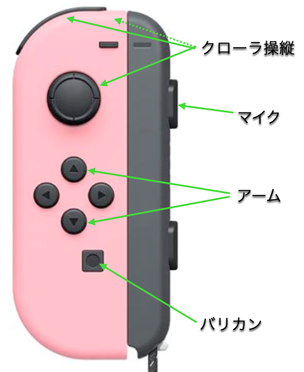
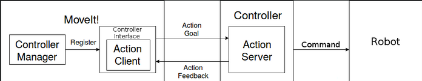

# バリカン除草用マニピュレータの作り方【ソフトウェア編】

ここで紹介する機能は，  
1. バリカン制御：バリカンのスイッチを自動でON/OFFする
2. アーム制御：アームの関節角を好きな位置に移動する

の２つです．

私の場合，任天堂の[Joy-Con](https://store-jp.nintendo.com/list/hardware-accessory/controller/HAC_A_JAVAF.html)をリモコンがわりにしています．
当然，他の物でも代替可能ですし，自然言語指示からの駆動も少しのアレンジで直ぐにできます．  

１のバリカン制御は，初心者でもできます．
２のアーム制御は，Moveit 2というライブラリの構造を熟知する必要があります．

また，用いる計算機のアーキテクチャによってJoy-conのパッケージが異なります．
私は，ThinkPadのラップトップ（amd64アーキテクチャ）とJetson orin nano（arm64アーキテクチャ）の２つの方法で実装しました．  
Joy-conのボタンの番号の割り当てがかなり異なることと，arm64の方ではスティックボタンが0,1の実数値しかなりません．
従って，Raspberry PiやJetsonに代表されるarm64の計算機を用いる場合，スティックボタンを割り当てるのはやめておくのが賢明でしょう．

## バリカン制御

## アーム制御  

私は [Moveit 2](https://moveit.picknik.ai/humble/index.html) を用いて制御しています．
実は，hand-eyeキャリブレーションによる精確なマニピュレーションタスク・障害物回避などの，複雑な制御をしていないです．よって，わざわざ Moveit 2を用いなくてもできます．

この図は，今回作るシステムの概要です．

右側のRobotのブロックは，今回の場合３つのモータを搭載したロボットアームです．  
左側のMoveit!のブロックは，Moveit!というライブラリの役割を表しており，ロボットアームの頭脳です．例えばプランニングをします．３つのモータそれぞれの関節角の目標値を決めます．  
それに挟まれたControllerのブロックは，ロボットアームとその頭脳を繋ぐものです．目標値をモータの仕様にあったコマンドに置き換えて，シリアル通信します．また，現在のモータの関節角も常時読み取ります．  

Moveit 2を用いることで，より柔軟なシステムを構築できます．
